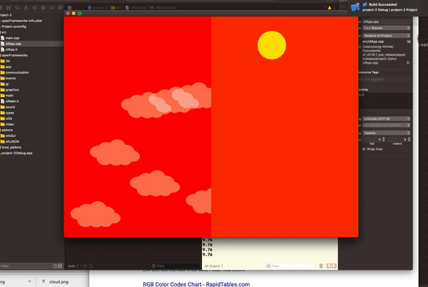

## Assignment 11 - Project2 Revision

### Description
I am using Dark Sky API to illustrate literal representation of current weather and conditions. 
I was able to achieve:

- pull informations from two different locations

- set background color depending on temperature of each place

- draw certain number of clouds depending on 'cloud cover' 

- clouds opacity is based on 'humidity'

- clouds moving at the speed of 

- sun placement depending on the time calculation between sunrise and sunset

- sun color is based on visibility level 

My future iteration:

- add a gui on the page

- more transitions among figures or elements I'm trying to visualize

### Video

