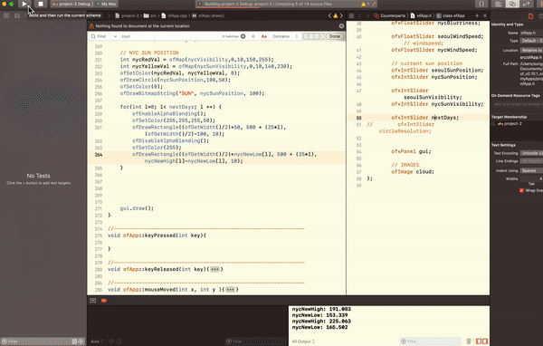

## Assignment 12 - Project2 Completed

### Description
This is a completed project2, using DarkSky API.

I am putting a direct representation of the weather of Seoul, South Korea and New York City, United States.

You're able to control gui panel to manipulate the followings:

- Background color to represent how hot it is ( based on 'current temperature')

- Number of clouds to represent cloudiness ( based on 'cloud cover' )

- Opacity of the clouds to represent Humidity ( based on 'humidity' )

- Movement of the clouds to represent how fast the wind is blowing ( based on 'wind speed' )

- Position of the sun to represent current time compared to sunrise and sunset time

- Visibility of the sun to represent how clear it is ( based on 'visibility' )

- Number of the days to show the next days' temperatures 

### Video

