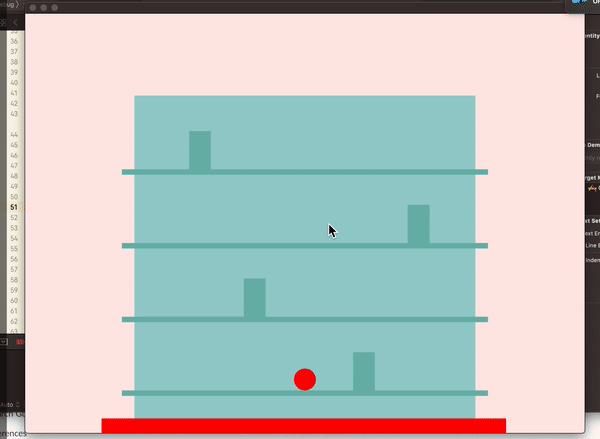

## Assignment 13 - Project3 Create a Game

### Description
I am creating a 'save-everyone-and-escape-from-the-building-on-fire' game.

All the settings & rules of the game are:

- (setting) the building is on fire.

- (setting) the fire keeps growing and gradually covers up the building

- User plays a main charactor

- main charactor is controlled by pressing 'left & right' key.

- main charactor can navigate through exit door  between different floors by pressing 'up & down' key on the door.

- main charactor can pick up others by moving towards them and pressing 'space' key.

- main charactor can drop people through window by approaching closely to the window and pressing 'space' key.

- When main charactor hits the fire, then game is over.

- scores are collected on top of the game. 

- ( future plan ) to have multiple level ( increased number of people & faster fire grow )

### Video

