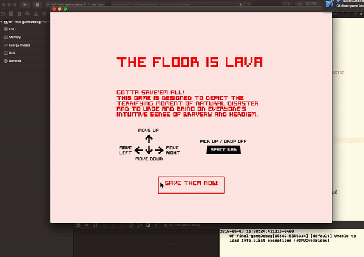

## Assignment 14 - Project3 - Game Revision

### Description
This week, the following steps were completed:

- make the Game main page

- make the character die if it hits the growing lava floor

- the caracter is able to pick up each person on any floor

- once the person is picked up, the pereson's position is attached to the main character

- all the windows are identifiable with its position

- all floors are drawn separately

Future plan:

- make the main character be able to drop the person out through window

- make two different colors for people and windows for harder levels

- score keeping systeme

### Video

