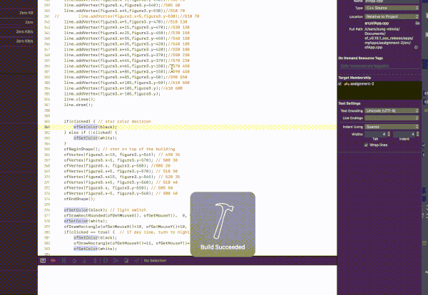

## Assignment 6

### Description
This week, I focused on creating a few movements that are triggered by mouse events. 

For first five seconds, I created a flag representation for the first scene that follows along the mouse movement. 

When mouse is clicked(and many times), the figure that is dancing is moving towards right and upward/downward.

Second five seconds show that the shadows on the mountains are moving depending on the mouse position, which is also the position of the Sun.

In addition, I added code for changing the background color depending on the position of the mouse. 

For the last five seconds, I drew a switch that follows the mouse position. When you click it triggers the building color, window color, and background color to switch over between day time and night time color scheme. 

### Video

