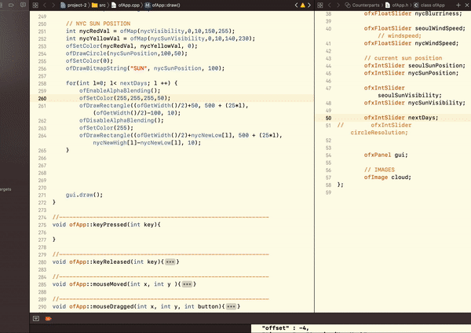
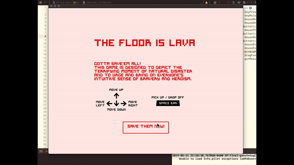

## Final Submission 

### Project1: Story-telling

#### Description

The story I am trying to tell in this project is based on my personal experience of residing in many different cities.

The cities I am introducing in the story are Korea, Seattle, and New York, and, the amount of memories introduced for each city equivalent to how long I've been in that city.

I inrtroduce Koroea first by:

- displaying the popular things in Korea

- having the users learn about the meanings each part of Korean flag consists of with mouse clicks

- also learn about how Korean characters look like as if it was an image puzzle

- showing them how long it would take flying over to Seattle, USA from Korea

Seattle is then introduced by:

- displaying popular companeis and significant things that are in Seattle

- telling them how the weather in Seattle is like with an animation created with Mount Rainier, Sun, and movement of shadows on the mountain, depending on your mouse location

- visualizaing my favorite events and activities, the Tulip Festival, snowboarding, 

- showing how long it would take flying over to New York City from  Seattle

Finally, New York is introduced by:

- animating the Empire State Building, Day version and Night version, swithced by mouse click

- 

th

#### Video

### Project2: API visualization
#### Description

Project 2 uses Dark Sky Api and its data about weathers in two different places, New York and Seoul

I am putting a direct representation of the weather of Seoul, South Korea and New York City, United States.

The visual representations are animated in relation to different conditions of each city's weather according to Dark Sky API.

The followings are the what the visuals representations are created based on, which is also controllable by the gui panel:

- Background color to represent how hot it is ( based on 'current temperature')

- Number of clouds to represent cloudiness ( based on 'cloud cover' )

- Opacity of the clouds to represent Humidity ( based on 'humidity' )

- Movement of the clouds to represent how fast the wind is blowing ( based on 'wind speed' )

- Position of the sun to represent current time compared to sunrise and sunset time

- Visibility of the sun to represent how clear it is ( based on 'visibility' )

- Number of the days to show the next days' temperatures ( based on each day's lowest and highest temperature)

#### Video

### Project3: Game
#### Description

The game I created is called 'The Floor is Lava,' where the floor gradually becomes covered by Lava, and, all the people(circles) must survive. This game is designed to urge and to bring out everyone's intuitive sense of braveness and heroism!

The character must save all people and get to the top of the building to hit the rescue flag to win the game.

The game rules are:

- The character is colored black

- The circles trapped inside are colored in two different colors, red and blue.

- Red colored circles can be saved only by red windows, and the blue ones only by blue windows.

- the character is able to navigate up and down through the doors located on each floor, using UP/DOWN key

- the character is able to pick up / drop off the character at any point of the floor and the building, using SPACE BAR key.

- once a circle is picked up, the character needs to get the same colored window as near as possible and press SPAPCE BAR key. 

- the character is able to save one circle at a time.

- the player wins when all circles are saved and the character gets to the top floor to hit the rescue(white) flag.

- the player loses when the lava starts to cover the character's body

#### Video

