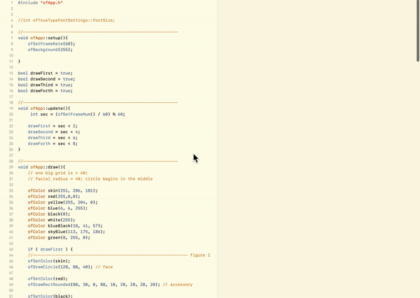

## Concept Descriptions

concept description ..

### Project 1

a narrative using primitive shapes
My first project will be a story telling about my experience of being able to call many cities home. It will be abstract illustration / movement of shapes and elements reveal the feelings. My audience could be anyone 

### Project 2

1) With weather API: My plan is to obtain a visual representation of weather forecast that engage physical human interaction on the screen. I imagine of having users to navigate through different dates, and based on a specific date, there will be a forecast screen using color representation

2) With quotes API ( if approved ): I want to play with random quotes provided from the API and create a visualization based on the words that are being used in the sentence. And when you select the word bubble, then you navigate into a scene where you can view all the available quotes about that word

### Project 3

## Video

This video shows total four elemtns I will be using in my first project. Each primitive shape element is displayed for two seconds.

